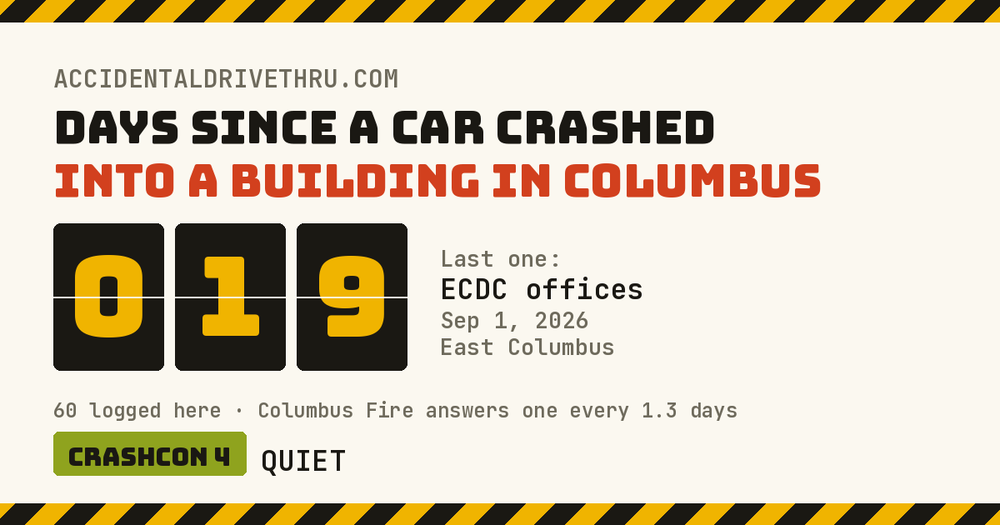

<div align="center">

<a href="https://accidentaldrivethru.com">
  
</a>

# Accidental Drive-Thru

**Columbus, Ohio's running count of days since a car crashed into a building. It has not been long.**

[accidentaldrivethru.com](https://accidentaldrivethru.com) · [How this is counted](https://accidentaldrivethru.com/about.html)

</div>

---

A days-since counter, incident log and map for one of Columbus's more reliable
traditions. A bot reads the local news every morning, adds anything new, redraws
the page and the share card above, and commits the result. The card isn't a
screenshot. It gets regenerated on every run, so a shared link always shows
the current count.

## What's on the board

- **The counter:** days since a crash last *made the news*, next to the Columbus Fire
  run rate (about one every 1.3 days) for scale.
- **Crashcon:** a threat level based on how quiet it's been.
- **Weekly odds:** a Poisson estimate of the chance of another crash, and of that
  crash getting written up.
- **Incident log:** every row links to the article it came from.
- **Map:** geocoded through OpenStreetMap Nominatim. Filled dots are pinned to a
  street address, and hollow dots are approximate (neighborhood only).
- **Implied odds:** the historical mix of what gets hit next (restaurants,
  homes, banks...). There is no market. Please do not bet on this.

The [about page](https://accidentaldrivethru.com/about.html) explains where the
numbers come from, what they miss, and why this board, the police and the fire
department all come up with different totals.

## How it works

```
614NOW feed / archive ──► update_incidents.py / backfill.py ──► data/incidents.json
                                                                        │
                                          geocode.py ◄──────────────────┤
                                     (lat/lon + data/geo.json)          │
                                                                        ▼
                                          build.py ──► index.html (data inlined)
                                          make_og.py ──► assets/og.png
```

The site is a single static `index.html` with its data inlined between
`<!-- DATA:START -->` and `<!-- DATA:END -->` markers. There's no build toolchain,
no framework and no runtime fetches, so it works from GitHub Pages, from `file://`,
or copied onto any other host.

| Script | What it does |
| --- | --- |
| `scripts/update_incidents.py` | Reads the 614NOW car-into-building RSS feed and appends new incidents with `review: true` |
| `scripts/backfill.py` | Walks the full 614NOW category archive (the feed only shows 10 posts) and pulls dates, times, addresses and vehicles from the article text. Pages are cached in `data/.cache/` |
| `scripts/geocode.py` | Geocodes new incidents through Nominatim (1 req/s, bounded to greater Columbus) and fetches the county and city outlines into `data/geo.json` |
| `scripts/build.py` | Sorts the incidents and injects them into `index.html` |
| `scripts/make_og.py` | Renders the 1200×630 share card with the current day count (needs Pillow) |

### Automation

| Workflow | Trigger | Does |
| --- | --- | --- |
| [`update-incidents.yml`](.github/workflows/update-incidents.yml) | Daily at 13:17 UTC (9:17am Columbus) + manual | feed → geocode → build → og card → commit `Another one (YYYY-MM-DD)` |
| [`backfill.yml`](.github/workflows/backfill.yml) | Manual only | archive walk → geocode → build → og card → commit |

Each workflow commits only when something actually changed.

## Running locally

Everything uses the Python standard library except the share card, which needs Pillow.

```sh
python3 scripts/update_incidents.py   # pull new incidents from the feed
python3 scripts/geocode.py            # place anything new on the map
python3 scripts/build.py              # inline data into index.html

pip install pillow
python3 scripts/make_og.py            # redraw assets/og.png

python3 -m http.server                # or just open index.html
```

`make_og.py` downloads Bungee and JetBrains Mono into `.fonts/` the first time it
runs. If the download fails, it falls back to DejaVu or Liberation.

## Data

`data/incidents.json` is a flat array with one object per crash:

```json
{
  "date": "2026-09-01",
  "time": "10:30",
  "name": "ECDC offices",
  "address": "E. Main St",
  "area": "East Columbus",
  "kind": "office",
  "cause": "unknown",
  "note": "Straight through the front door. Nobody hurt.",
  "source": "ABC6",
  "url": "https://abc6onyourside.com/news/local/...",
  "lat": 39.95476,
  "lon": -82.85301,
  "geo": "street"
}
```

| Field | Notes |
| --- | --- |
| `date` | The crash date when the article states one, otherwise the publish date (often a day or two late) |
| `time` | `HH:MM` if the article quotes it, otherwise empty |
| `kind` | `restaurant`, `bar`, `retail`, `medical`, `bank`, `home`, `school`, `nonprofit`, `office`, `other` |
| `cause` | `drunk`, `hit & run`, `medical`, `pedal error`, `parking`, `reverse`, `delivery`, `police chase`, `unknown` |
| `geo` | How the pin was placed: `address`, `street`, `area` (approximate) or `name`. Missing when too vague to place, and counted under the map instead |
| `review` | `true` when a bot added the entry and a person still needs to check the details |

Most incidents come from 614NOW automatically. A few from NBC4, ABC6,
Columbus Underground and Wikipedia were entered by hand.

## Corrections

If a row is wrong (wrong date, wrong business, wrong street, or your building is
on here and shouldn't be), [open an issue](../../issues) or send a PR that edits
`data/incidents.json`. It's one JSON file, so corrections are easy.

## Credits

Incident reporting by [614NOW](https://614now.com/),
[Columbus Underground](https://columbusunderground.com/), NBC4 and ABC6.
Tracking credit to [@cbuscarikaze](https://www.instagram.com/cbuscarikaze/).
Fire run figures from Columbus Division of Fire via NBC4.
Map data © [OpenStreetMap](https://www.openstreetmap.org/copyright) contributors, ODbL.
